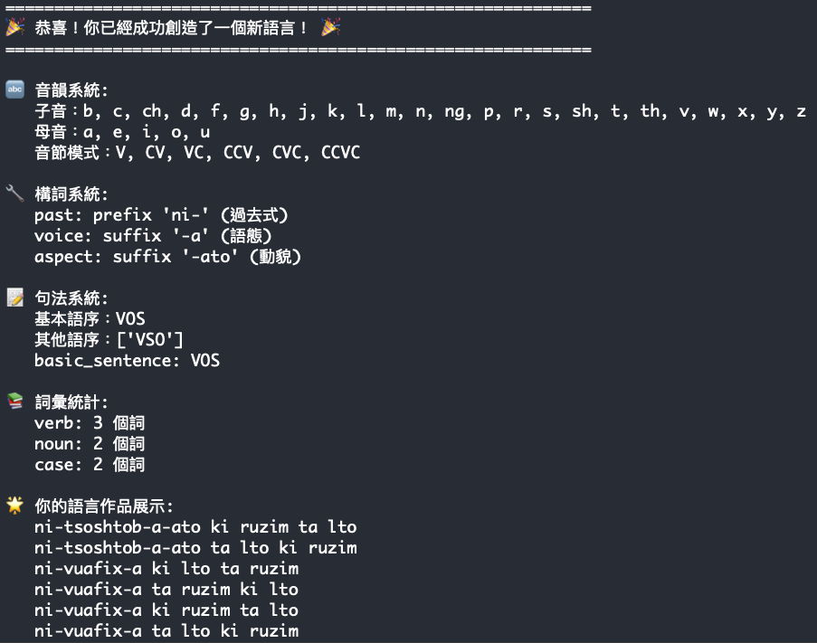

# SirayaCreator

# 西拉雅語
## 1. 語料
[馬太福音](https://storage.googleapis.com/siraya/20230218/matt.html#0.0)

## 2. 規則
- **音韻**
	- 六種音節結構：`['V', 'CV', 'VC', 'CCV', 'CVC', 'CCVC']`
	- 子音：依據網站中的語料編撰方式無使用 `q`，其他子音皆有使用。
	- 母音：`['a', 'e', 'i', 'o', 'u']`

- **構詞**
	- 動詞過去式：帶有前綴 `ni-`
	- 動詞語態：帶有後綴 `-a` 等等，僅呈現此種
	- 動詞完成貌：帶有後綴 `-ato`

- **句法**
	- 語序：基本語序為 **VOS**，同時允許 **VSO** 語序。

## 3. 執行結果

